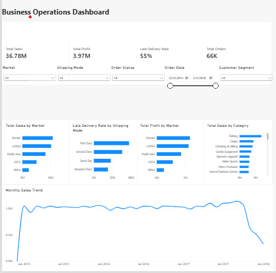

# Business Operations Analytics Dashboard

A business operations analytics project built with PostgreSQL and Microsoft Power BI using the DataCo SMART Supply Chain dataset.

The project analyzes more than 180,000 supply-chain records to examine sales, profitability, product performance, markets, shipping methods, and late deliveries.

## Dashboard

## Key Metrics

- Total Sales: $36.78M
- Total Profit: $3.97M
- Late Deliveries: 98,977
- Orders: 65,752
- Customers: 20,652
- Products: 118

## Dashboard Analysis

The dashboard provides several views of business performance:

- Total Sales by Market
- Total Profit by Market
- Total Sales by Category
- Late Delivery Rate by Shipping Mode
- Monthly Sales Trend

Interactive filters allow analysis by:

- Market
- Shipping Mode
- Order Status
- Order Date
- Customer Segment

## Key Findings

Europe generated the highest total sales at approximately $10.87M and the highest total profit at approximately $1.17M.

LATAM was the second-largest market, generating approximately $10.28M in sales and $1.12M in profit.

Fishing was the highest-revenue product category at approximately $6.93M, followed by Cleats at $4.43M and Camping & Hiking at $4.12M.

Delivery performance varied substantially by shipping mode:

- First Class: 95.32% late-delivery rate
- Second Class: 76.63%
- Same Day: 45.74%
- Standard Class: 38.07%

Monthly sales remained relatively stable through much of 2015–2017 before declining sharply near the end of the dataset.

## Data Validation

Dashboard results were independently validated against PostgreSQL queries.

Validated metrics include:

- Total Sales
- Total Profit
- Late Deliveries
- Sales by Market
- Profit by Market
- Sales by Category
- Late Delivery Rate by Shipping Mode
- Monthly Sales Trend

## Technology

- PostgreSQL
- Microsoft Power BI
- SQL
- Git / GitHub

## Dataset

DataCo SMART Supply Chain dataset.

The raw dataset contains 180,519 records. Data was loaded into PostgreSQL and transformed into an analytics-ready table before being imported into Power BI.